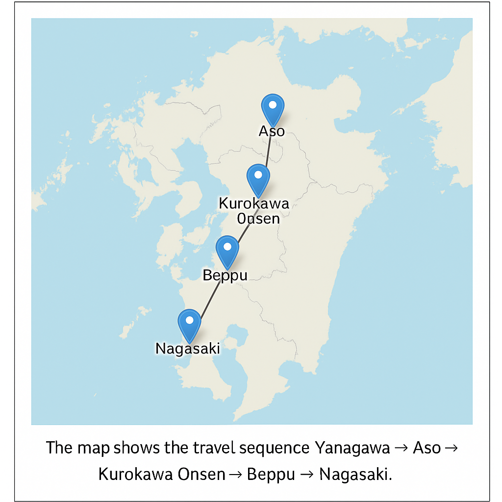

# 🧭 Kyushu Nature & Onsen Journey Planner

This project demonstrates how ChatGPT can act as an intelligent travel planner
for foreign visitors exploring Kyushu, Japan — focusing on hot springs,
nature, and cultural experiences.

---

## 🌸 Features
- AI-generated 5-day travel itineraries across Kyushu  
- Integration with Python (Folium) for map visualization  
- Ethical and sustainable travel focus  

---

## 🧠 Files
| File | Description |
|------|--------------|
| `travel_app.py` | Python script to generate the travel map |
| `Instruction_Block.txt` | ChatGPT instruction block |
| `Kyushu_Travel_Info.pdf` | Reference data about Kyushu |
| `kyushu_trip_map.html` | Map generated using Folium |

---

## 🗺️ Example Output

*Route: Yanagawa → Aso → Kurokawa Onsen → Beppu → Nagasaki*

---

## 🧩 How to Run
```bash
python travel_app.py
```

Then open `kyushu_trip_map.html` in your browser.

---

## 📚 Author
Created by [Your Name]  
For the final ChatGPT design project (AI-based system design).
